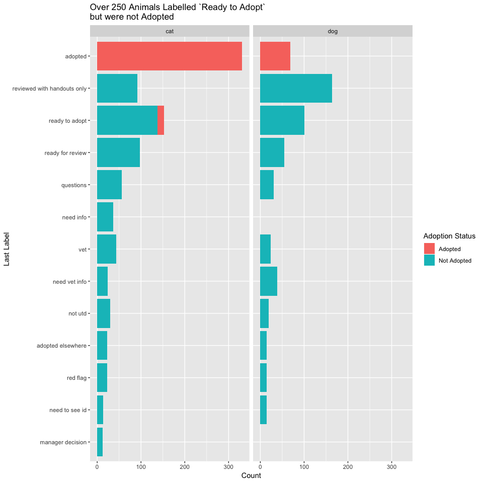

PAWS EDA
================
Brendan Graham

``` r
library(dplyr)
```

    ## 
    ## Attaching package: 'dplyr'

    ## The following objects are masked from 'package:stats':
    ## 
    ##     filter, lag

    ## The following objects are masked from 'package:base':
    ## 
    ##     intersect, setdiff, setequal, union

``` r
library(ggplot2)
```

``` r
master <- readRDS("~/R Working Directory/Other/2019_datathon/Analyses/2_Applicants/masterapps_20190324.rds")

# unique(master$outcome_type)

#assign 0 or 1 depending on adoption outcome
master  <- master %>%
  mutate(outcome_type_adj = ifelse(is.na(outcome_type), "Not Adopted", "Adopted"))

# master %>%
#   group_by(animal_type, outcome_type) %>%
#   dplyr::summarise(count = n()) %>%
#   ggplot(., aes(x = as.factor(outcome_type), y = count, fill = animal_type)) + geom_bar(stat = "identity", position = "dodge")

master %>%
  group_by(animal_type, outcome_type_adj, last_label) %>%
  dplyr::summarise(count = n()) %>%
  arrange(desc(count)) %>%
  head(25) %>%
  ggplot(., aes(x = reorder(last_label, count), y = count, fill = as.factor(outcome_type_adj))) + 
  geom_bar(stat = "identity", position = "stack") +
  coord_flip() + 
  facet_grid(.~animal_type) + 
  labs(x = "Last Label",
       y = "Count", 
       fill = "Adoption Status", 
       title = "Over 250 Animals Labelled `Ready to Adopt`\nbut were not Adopted")
```


